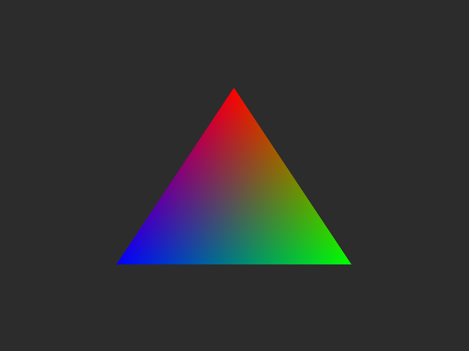
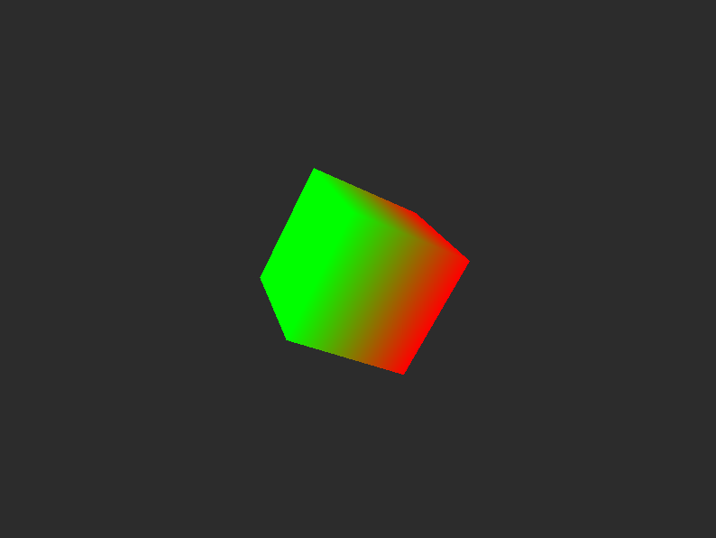
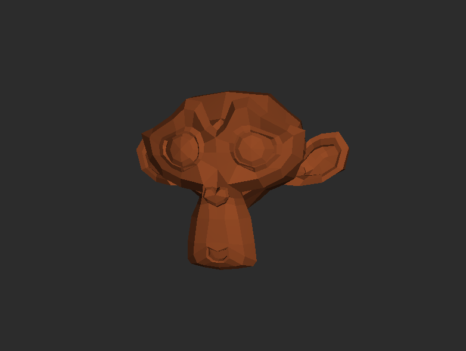

# shard
Shard is a 2D game engine built with nothing but Vulkan and C++20 (
    [GLFW](https://www.glfw.org/),
    [VMA](https://gpuopen.com/vulkan-memory-allocator/),
    and [GLM](https://github.com/g-truc/glm)
). 

# Examples
## [Triangle](examples/01-triangle)
> 
## [Cube](examples/02-cube)
> 
## [Texture](examples/03-texture)
> 
## [Model](examples/04-model)
> 

# License
Shard is under the Apache License. [LICENSE](LICENSE)

# 3rd Party Libraries
> [Vulkan SDK](https://vulkan.lunarg.com/) 
> [GLFW](https://www.glfw.org/) 
> [VMA](https://gpuopen.com/vulkan-memory-allocator/) 
> [GLM](https://github.com/g-truc/glm) 
> [STB Image](https://github.com/nothings/stb/blob/master/stb_image.h) 
> [Miniaudio](https://github.com/mackron/miniaudio) 
> [Tiny OBJ Loader](https://github.com/tinyobjloader/tinyobjloader)

# WARNING
If you are looking for something to make a game with I would not recommend using this: 
> It is still in very early stages of development and I am just making it for fun. 
But I would recommend it if you just want to mess around with something and possibly learn some
Vulkan through the source code.