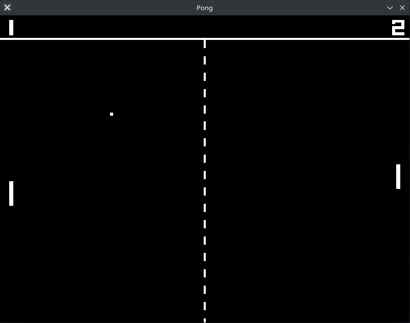

# shard
Shard is a 2D game engine built with nothing but Vulkan and C++20 (
    [GLFW](https://www.glfw.org/),
    [VMA](https://gpuopen.com/vulkan-memory-allocator/),
    and [GLM](https://github.com/g-truc/glm)
). 
Right now the engine is still hugely a work in progress, but in its current state
some basic games are still possible without to much pain.

# Examples
> Pong: 
> 

# WARNING
If you are looking for something to make a game with I would not recommend using this: 
> It is still in very early stages of development and I am just making it for fun. 
But I would recommend it if you just want to mess around with something and possibly learn some
vulkan through the source code.